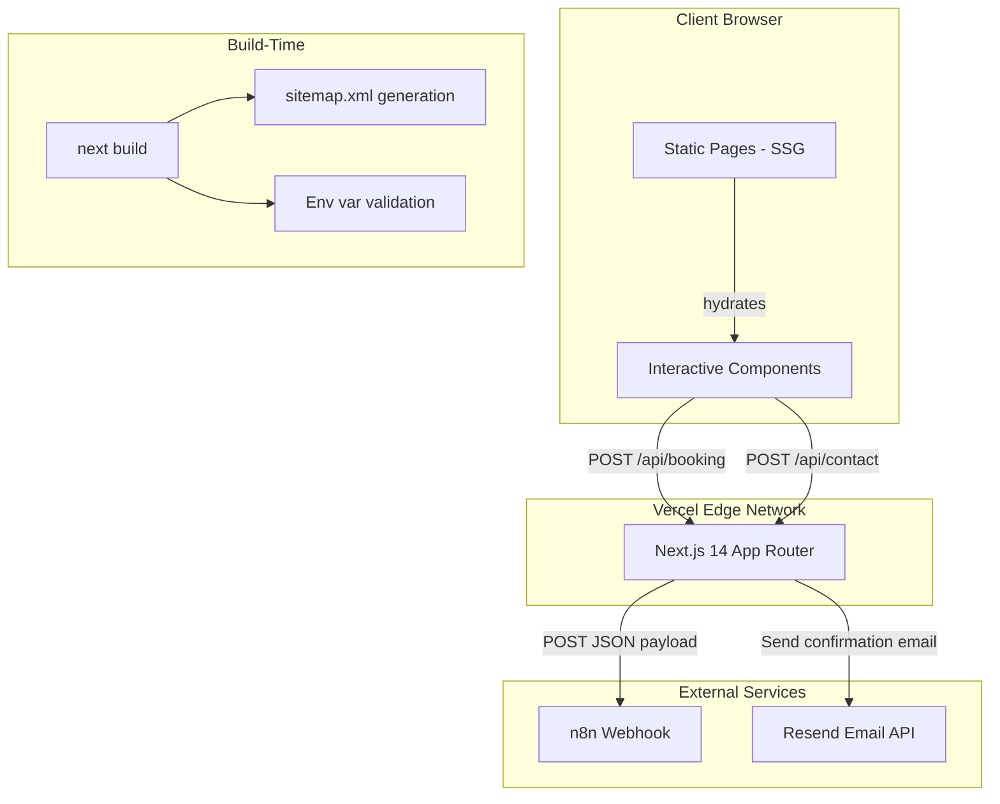
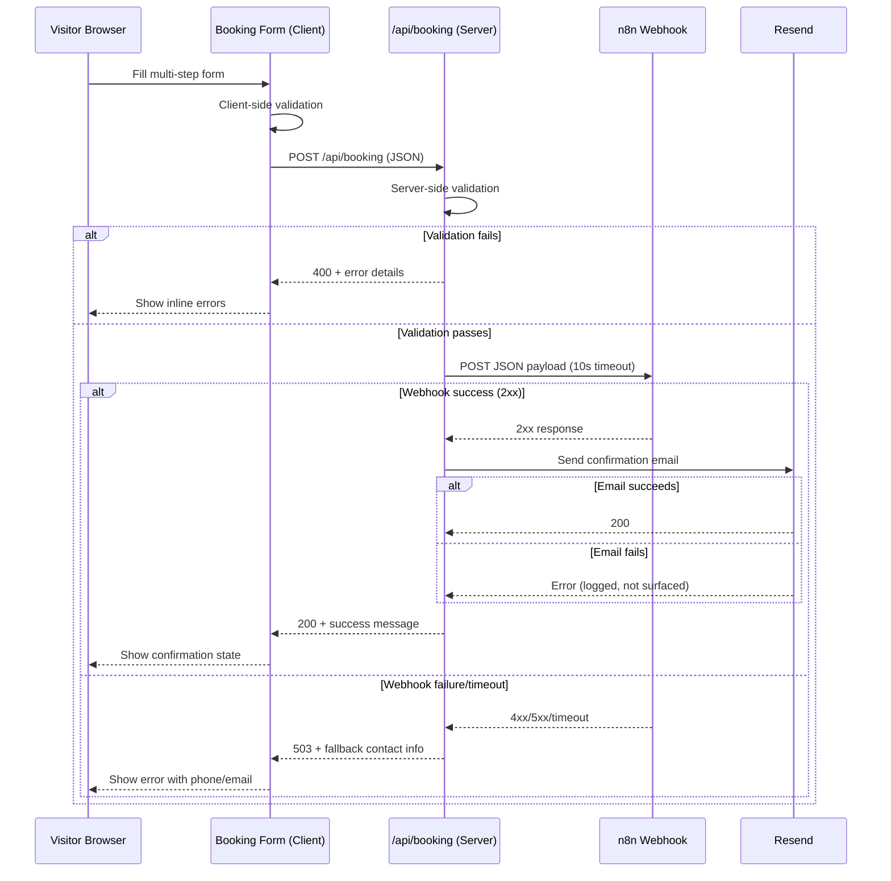
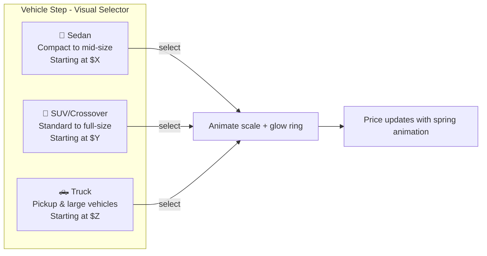

# Design Document: Auto Detailing Website

## Overview

This document describes the technical design for a production-ready, motion-rich marketing and booking website for a USA-based auto detailing business. The architecture is a stateless Next.js 14 App Router application deployed on Vercel, forwarding bookings to an n8n webhook for downstream automation. No database — all data flows are fire-and-forget to external services (n8n, Resend).

The design philosophy is **"showroom-grade UI/UX"** — leveraging Framer Motion's full animation toolkit (layout animations, gesture interactions, AnimatePresence page transitions, staggered reveals) combined with shadcn/ui's polished component system to create a visually premium experience that matches the quality of a professional detailing service.

The system is composed of:
- **Static marketing pages** (Home, Services, Gallery, About, Reviews, FAQ, Legal) rendered at build time via SSG with cinematic scroll-driven animations
- **Interactive client components** (Booking Form with visual vehicle selector, Contact Form, Gallery Lightbox with gesture controls, FAQ Accordion, Mobile Nav with spring physics)
- **API routes** (`/api/booking`, `/api/contact`) that validate payloads and forward to external services
- **Motion design system** powered by Framer Motion — page transitions, parallax hero, staggered grids, magnetic hover effects, morphing step indicators, and gesture-driven galleries
- **SEO layer** with JSON-LD structured data, sitemap generation, and per-page metadata
- **Visual vehicle selection** — image-based cards showing actual Sedan, SUV, Truck silhouettes that scale and highlight on selection, with dynamic pricing that animates into view

## Architecture

### System Diagram



### Request Flow: Booking Submission



### Rendering Strategy

| Page | Rendering | Motion Features |
|------|-----------|-----------------|
| Home | SSG (Static) | Parallax hero, staggered cards, count-up trust bar, scroll reveals |
| Services | SSG | 3D tilt cards, vehicle image showcase, hover flip |
| Gallery | SSG + Client Hydration | Masonry stagger, gesture lightbox, filter layout animation |
| Book Now | CSR (Client Component) | Step transitions, vehicle card selection, price counter, drag-drop photos |
| About | SSG | Scroll reveal, parallax layers, text reveal |
| Reviews | SSG + Client Hydration | Stagger cards, animated bar chart, star burst animation |
| FAQ | SSG + Client Hydration | Spring accordion, category pill transitions |
| Contact | CSR (Client Component) | Floating labels, magnetic button, validation shake |
| Privacy/Terms | SSG | Minimal (fade-in only) |

### Visual Asset Requirements

```
public/brand/
├── vehicles/
│   ├── sedan.png              # Vehicle silhouette (min 600x400, transparent BG)
│   ├── sedan-detailing.png    # Sedan being detailed (service step)
│   ├── suv.png                # SUV silhouette
│   ├── suv-detailing.png      # SUV being detailed
│   ├── truck.png              # Truck silhouette
│   └── truck-detailing.png    # Truck being detailed
├── hero/
│   ├── hero-bg.jpg            # Hero background (min 1920x1080)
│   └── hero-mobile.jpg        # Mobile hero (min 750x1334)
├── gallery/
│   └── [before-after pairs]   # Min 6 pairs, 1200x800 each
├── team/
│   └── owner.jpg              # Owner photo (min 400x400)
├── icons/
│   ├── certifications/        # Badge PNGs
│   └── services/              # Service icon SVGs
└── README.md                  # Asset manifest with dimensions
```

## Components and Interfaces

### Directory Structure

```
src/
├── app/
│   ├── layout.tsx              # Root layout (nav + footer + page transitions)
│   ├── page.tsx                # Home page
│   ├── services/page.tsx
│   ├── gallery/page.tsx
│   ├── book/page.tsx
│   ├── about/page.tsx
│   ├── reviews/page.tsx
│   ├── faq/page.tsx
│   ├── contact/page.tsx
│   ├── privacy/page.tsx
│   ├── terms/page.tsx
│   ├── sitemap.ts              # Dynamic sitemap generation
│   ├── robots.ts               # robots.txt generation
│   └── api/
│       ├── booking/route.ts
│       └── contact/route.ts
├── components/
│   ├── layout/
│   │   ├── Navigation.tsx      # Glassmorphism header with backdrop blur
│   │   ├── MobileMenu.tsx      # Spring-animated slide-out panel
│   │   ├── Footer.tsx
│   │   └── PageTransition.tsx  # AnimatePresence page wrapper
│   ├── home/
│   │   ├── HeroSection.tsx     # Parallax hero with video/image BG
│   │   ├── ServicesOverview.tsx # 3D tilt cards with hover depth
│   │   ├── GalleryPreview.tsx  # Drag-to-scroll carousel
│   │   ├── TestimonialsSection.tsx  # Auto-rotating with gesture swipe
│   │   ├── TrustBar.tsx        # Counter animation (count-up on scroll)
│   │   └── CTASection.tsx      # Pulsing gradient CTA
│   ├── services/
│   │   ├── PackageCard.tsx     # Flip-on-hover 3D card with pricing
│   │   ├── VehicleShowcase.tsx # Animated vehicle images per size
│   │   └── AddOnList.tsx       # Checkbox with spring toggle
│   ├── gallery/
│   │   ├── GalleryGrid.tsx     # Masonry with staggered reveal
│   │   ├── GalleryFilter.tsx   # Animated tab pills with layout transition
│   │   └── Lightbox.tsx        # Gesture-driven (pinch, swipe, drag)
│   ├── booking/
│   │   ├── BookingForm.tsx     # Multi-step orchestrator with AnimatePresence
│   │   ├── StepIndicator.tsx   # Morphing progress bar with spring physics
│   │   ├── VehicleStep.tsx     # Image-based vehicle selector cards
│   │   ├── PhotosStep.tsx      # Drag-and-drop with preview grid
│   │   ├── ServiceStep.tsx     # Visual package selector with price animation
│   │   ├── DateTimeStep.tsx    # Calendar with available slot highlights
│   │   ├── ContactStep.tsx     # Floating label inputs with validation shake
│   │   └── ConfirmationStep.tsx # Summary with edit-in-place animation
│   ├── reviews/
│   │   ├── ReviewCard.tsx      # Stagger-in with parallax depth
│   │   ├── RatingSummary.tsx   # Animated bar chart distribution
│   │   └── StarRating.tsx      # Fill animation with particle burst
│   ├── faq/
│   │   └── Accordion.tsx       # Spring-animated expand/collapse
│   ├── contact/
│   │   └── ContactForm.tsx     # Magnetic button + floating labels
│   ├── motion/
│   │   ├── ScrollReveal.tsx    # IntersectionObserver + Framer wrapper
│   │   ├── StaggeredGrid.tsx   # Orchestrated stagger container
│   │   ├── ParallaxLayer.tsx   # useScroll + useTransform parallax
│   │   ├── MagneticButton.tsx  # Mouse-tracking magnetic effect
│   │   ├── CountUp.tsx         # Animated number counter
│   │   ├── TiltCard.tsx        # 3D perspective tilt on mouse move
│   │   ├── TextReveal.tsx      # Character-by-character text animation
│   │   ├── SlideIn.tsx         # Directional slide entrance
│   │   └── GestureCarousel.tsx # Drag/swipe carousel with momentum
│   └── ui/                     # shadcn/ui components (Button, Card, Input, etc.)
├── lib/
│   ├── validation.ts           # Zod schemas for forms + API
│   ├── email.ts                # Resend email wrapper
│   ├── webhook.ts              # n8n webhook client
│   ├── pricing.ts              # Price calculation engine
│   ├── constants.ts            # Service packages, pricing, add-ons, vehicle data
│   ├── motion-config.ts        # Shared animation variants + spring configs
│   └── env.ts                  # Environment variable validation
├── types/
│   └── index.ts                # Shared TypeScript types
├── data/
│   ├── services.ts             # Package/AddOn/Vehicle data with images
│   ├── reviews.ts              # Testimonial data
│   ├── gallery.ts              # Gallery items with categories
│   └── faq.ts                  # FAQ categories and questions
├── hooks/
│   ├── useReducedMotion.ts     # prefers-reduced-motion detector
│   ├── useInView.ts            # Intersection observer hook
│   └── useMediaQuery.ts        # Responsive breakpoint hook
└── styles/
    └── globals.css             # Tailwind directives + custom vars + animations
```

### Motion Design System

The animation layer uses a centralized config for consistency:

```typescript
// lib/motion-config.ts
export const springConfig = {
  gentle: { type: 'spring', stiffness: 120, damping: 14 },
  snappy: { type: 'spring', stiffness: 300, damping: 20 },
  bouncy: { type: 'spring', stiffness: 400, damping: 10 },
} as const;

export const variants = {
  fadeUp: {
    hidden: { opacity: 0, y: 24 },
    visible: { opacity: 1, y: 0, transition: { duration: 0.5 } },
  },
  staggerContainer: {
    hidden: {},
    visible: { transition: { staggerChildren: 0.1, delayChildren: 0.1 } },
  },
  scaleIn: {
    hidden: { opacity: 0, scale: 0.9 },
    visible: { opacity: 1, scale: 1, transition: springConfig.gentle },
  },
  slideInLeft: {
    hidden: { opacity: 0, x: -40 },
    visible: { opacity: 1, x: 0, transition: springConfig.gentle },
  },
  slideInRight: {
    hidden: { opacity: 0, x: 40 },
    visible: { opacity: 1, x: 0, transition: springConfig.gentle },
  },
  pageEnter: {
    initial: { opacity: 0, y: 20 },
    animate: { opacity: 1, y: 0, transition: { duration: 0.3 } },
    exit: { opacity: 0, y: -20, transition: { duration: 0.2 } },
  },
} as const;

export const hoverEffects = {
  lift: { scale: 1.03, y: -4, boxShadow: '0 20px 40px rgba(0,0,0,0.15)' },
  tilt3D: { rotateX: -5, rotateY: 5, z: 20 },
  magnetic: { scale: 1.05 },
} as const;
```

### Vehicle Selection UI Design

The vehicle selection step uses large, visually rich cards with actual vehicle imagery:



```typescript
// components/booking/VehicleStep.tsx
interface VehicleOption {
  id: VehicleSize;
  label: string;
  description: string;
  image: string;           // Vehicle silhouette/photo path
  startingPrice: number;   // Lowest package price for this size
}

const VEHICLE_OPTIONS: VehicleOption[] = [
  {
    id: 'sedan',
    label: 'Sedan',
    description: 'Compact, mid-size & coupes',
    image: '/brand/vehicles/sedan.png',
    startingPrice: 49,
  },
  {
    id: 'suv',
    label: 'SUV / Crossover',
    description: 'Standard SUVs & crossovers',
    image: '/brand/vehicles/suv.png',
    startingPrice: 69,
  },
  {
    id: 'truck',
    label: 'Truck',
    description: 'Pickups & large vehicles',
    image: '/brand/vehicles/truck.png',
    startingPrice: 89,
  },
];
```

The selection interaction:
1. Cards display at rest with subtle idle animation (floating shadow)
2. On hover: TiltCard 3D effect + shadow depth increase
3. On select: Spring scale-up (1.05), glowing ring border animation, checkmark morphs in
4. Unselected cards: Scale down slightly (0.97), reduce opacity to 0.6
5. Price badge animates with CountUp from 0 to starting price

### Key Component Interfaces

#### Navigation Component (Glassmorphism + Spring Physics)

```typescript
// components/layout/Navigation.tsx
interface NavigationProps {
  currentPath: string;
}

const NAV_LINKS = [
  { href: '/', label: 'Home' },
  { href: '/services', label: 'Services' },
  { href: '/gallery', label: 'Gallery' },
  { href: '/book', label: 'Book Now', isCTA: true },
  { href: '/about', label: 'About' },
  { href: '/reviews', label: 'Reviews' },
  { href: '/faq', label: 'FAQ' },
  { href: '/contact', label: 'Contact' },
] as const;

// Nav uses: backdrop-blur-lg bg-white/80 dark:bg-black/80
// Mobile menu: AnimatePresence + motion.div with spring slide from right
// Active link: animated underline with layoutId for shared layout animation
```

#### Page Transition Wrapper

```typescript
// components/layout/PageTransition.tsx
'use client';
import { motion, AnimatePresence } from 'framer-motion';
import { usePathname } from 'next/navigation';

// Wraps page content with fade+slide transitions between routes
// Uses AnimatePresence mode="wait" for sequential enter/exit
```

#### Booking Form State Machine (with visual vehicle selection)

```typescript
// components/booking/BookingForm.tsx
type BookingStep = 1 | 2 | 3 | 4 | 5 | 6;

interface BookingFormState {
  currentStep: BookingStep;
  vehicle: VehicleSize | null;
  photos: File[];
  photosPreviews: string[];   // Object URLs for drag-and-drop previews
  service: ServicePackageId | null;
  addOns: AddOnId[];
  estimatedPrice: number;     // Animated with spring when changes
  date: string | null;
  timeSlot: string | null;
  contact: ContactInfo | null;
  isSubmitting: boolean;
  submitError: string | null;
}

type BookingFormAction =
  | { type: 'SET_VEHICLE'; payload: VehicleSize }
  | { type: 'ADD_PHOTO'; payload: File }
  | { type: 'REMOVE_PHOTO'; payload: number }
  | { type: 'SET_SERVICE'; payload: ServicePackageId }
  | { type: 'TOGGLE_ADDON'; payload: AddOnId }
  | { type: 'SET_DATE'; payload: string }
  | { type: 'SET_TIME_SLOT'; payload: string }
  | { type: 'SET_CONTACT'; payload: ContactInfo }
  | { type: 'NEXT_STEP' }
  | { type: 'PREV_STEP' }
  | { type: 'GO_TO_STEP'; payload: BookingStep }
  | { type: 'SUBMIT_START' }
  | { type: 'SUBMIT_SUCCESS' }
  | { type: 'SUBMIT_ERROR'; payload: string };

// Step transitions use AnimatePresence with directional variants:
// - Forward: slide from right + fade in
// - Backward: slide from left + fade in
// - StepIndicator: morphing progress dots with layoutId
```

#### Service Selection with Visual Price Animation

```typescript
// components/booking/ServiceStep.tsx
interface ServiceStepProps {
  vehicleSize: VehicleSize;
  selectedService: ServicePackageId | null;
  selectedAddOns: AddOnId[];
  onSelectService: (id: ServicePackageId) => void;
  onToggleAddOn: (id: AddOnId) => void;
}

// Each package card shows:
// - Vehicle image matching selected size (sedan/SUV/truck being detailed)
// - Package name with gradient text
// - Included services as animated checklist (stagger in)
// - Price with CountUp animation from previous value to new value
// - Selected state: glowing border + scale spring
// - Add-ons: toggle chips with spring animation
// - Running total: fixed bottom bar with animated price counter
```

#### Lightbox with Gesture Controls

```typescript
// components/gallery/Lightbox.tsx
interface LightboxProps {
  images: ImageData[];
  currentIndex: number;
  isOpen: boolean;
  onClose: () => void;
  onNavigate: (index: number) => void;
}

// Interactions:
// - Swipe left/right: navigate (with momentum + elastic overscroll)
// - Pinch to zoom (mobile)
// - Drag to dismiss (drag down threshold = close)
// - Double-tap to zoom
// - Keyboard: Escape close, arrows navigate
// - Background: blurred backdrop with motion.div scale animation
```

## Data Models

### Vehicle Model (with visual assets)

```typescript
type VehicleSize = 'sedan' | 'suv' | 'truck';

interface VehicleOption {
  id: VehicleSize;
  label: string;
  description: string;
  image: string;              // Path to vehicle silhouette/photo
  detailingImage: string;     // Path to vehicle being detailed (for service step)
  startingPrice: number;      // Lowest package price for quick reference
}
```

### Service Package Model

```typescript
type ServicePackageId = 'basic-wash' | 'full-detail' | 'ceramic-coating';
type AddOnId = string;

interface ServicePackage {
  id: ServicePackageId;
  name: string;
  description: string;
  shortDescription: string;      // For overview cards
  icon: string;                  // Lucide icon name or SVG path
  includedServices: string[];
  pricing: Record<VehicleSize, number>;  // "Starting at" prices
  highlightColor: string;        // Gradient accent color for card
  vehicleImages: Record<VehicleSize, string>; // Per-vehicle image when selected
}

interface AddOn {
  id: AddOnId;
  name: string;
  description: string;
  price: number;
  icon: string;
}
```

### Review Model

```typescript
interface Review {
  id: string;
  customerName: string;
  rating: 1 | 2 | 3 | 4 | 5;
  serviceReceived: string;
  vehicleType: string;           // "2022 BMW 3 Series" etc.
  text: string;
  date: string;                  // ISO date for sorting
  avatar?: string;               // Optional customer avatar placeholder
}

interface RatingSummary {
  average: number;               // 1 decimal place
  totalReviews: number;
  distribution: Record<1 | 2 | 3 | 4 | 5, number>;
}
```

### Gallery Model

```typescript
interface GalleryItem {
  id: string;
  category: ServicePackageId;
  vehicleType: string;           // "Sedan", "SUV", etc. for display
  beforeImage: ImageData;
  afterImage: ImageData;
}

interface ImageData {
  src: string;
  alt: string;                   // Max 125 chars
  width: number;
  height: number;
  blurDataURL?: string;          // For placeholder blur-up
}
```

### FAQ Model

```typescript
interface FAQCategory {
  id: string;
  name: string;
  icon: string;                  // Lucide icon for category header
  questions: FAQItem[];
}

interface FAQItem {
  id: string;
  question: string;
  answer: string;
}
```

### Contact Form Model

```typescript
interface ContactFormData {
  name: string;                  // 1-100 chars
  email: string;                 // Valid email
  subject: string;               // 1-200 chars
  message: string;               // 1-2000 chars
}
```

### Booking API Models

```typescript
// app/api/booking/route.ts
interface BookingPayload {
  vehicleSize: VehicleSize;
  photos: string[];              // Base64-encoded image data
  servicePackage: ServicePackageId;
  addOns: AddOnId[];
  estimatedPrice: number;
  preferredDate: string;         // ISO date
  timeSlot: string;
  contact: {
    fullName: string;
    email: string;
    phone: string;
    notes?: string;
  };
}

interface BookingResponse {
  success: boolean;
  message: string;
  fallbackContact?: {
    phone: string;
    email: string;
  };
}
```

### Booking Validation Schema (Zod)

```typescript
import { z } from 'zod';

const vehicleSizeSchema = z.enum(['sedan', 'suv', 'truck']);

const contactSchema = z.object({
  fullName: z.string().min(1).max(100),
  email: z.string().email(),
  phone: z.string().regex(/^(\+1)?[\s.-]?\(?\d{3}\)?[\s.-]?\d{3}[\s.-]?\d{4}$/),
  notes: z.string().max(500).optional(),
});

const bookingSchema = z.object({
  vehicleSize: vehicleSizeSchema,
  photos: z.array(z.string()).max(5),
  servicePackage: z.enum(['basic-wash', 'full-detail', 'ceramic-coating']),
  addOns: z.array(z.string()),
  estimatedPrice: z.number().positive(),
  preferredDate: z.string().refine(isAtLeast24HoursInFuture),
  timeSlot: z.string().min(1),
  contact: contactSchema,
});

const contactFormSchema = z.object({
  name: z.string().min(1).max(100),
  email: z.string().email(),
  subject: z.string().min(1).max(200),
  message: z.string().min(1).max(2000),
});
```

### Environment Configuration

```typescript
// lib/env.ts
interface EnvConfig {
  N8N_WEBHOOK_URL: string;
  RESEND_API_KEY: string;
  NEXT_PUBLIC_BUSINESS_NAME: string;
  BUSINESS_EMAIL?: string;   // For contact form recipient
}
```


## Correctness Properties

*A property is a characteristic or behavior that should hold true across all valid executions of a system — essentially, a formal statement about what the system should do. Properties serve as the bridge between human-readable specifications and machine-verifiable correctness guarantees.*

### Property 1: Service Data Rendering Completeness

*For any* valid ServicePackage (with name, description, includedServices, and pricing for all VehicleSizes) and *for any* valid AddOn (with name, description, and price), rendering the respective component should produce output containing all data fields: the package name, description, every included service, "Starting at" prefix with each VehicleSize price, and for AddOns, the name, description, and price.

**Validates: Requirements 3.1, 3.2, 3.3**

### Property 2: Gallery Category Filter Correctness

*For any* set of GalleryItems with mixed categories and *for any* selected category filter (including "All"), the filtered results should contain only items whose category matches the selected filter. When "All" is selected, all items should be returned. The filter should never add items that don't exist in the source data.

**Validates: Requirements 4.3**

### Property 3: Lightbox Circular Navigation

*For any* gallery containing N items (N ≥ 1) and *for any* current index position, navigating "next" from index N-1 should result in index 0, and navigating "previous" from index 0 should result in index N-1. For all other positions, next increments and previous decrements by 1.

**Validates: Requirements 4.6**

### Property 4: Photo Upload Validation

*For any* file with a given MIME type and size, the upload validator should accept the file if and only if: the type is one of "image/jpeg", "image/png", or "image/webp", AND the size is ≤ 5MB, AND the current upload count is less than 5. Invalid files should be rejected with an error indicating the specific reason (wrong type or size exceeded).

**Validates: Requirements 5.4, 5.5**

### Property 5: Price Calculation Correctness

*For any* valid VehicleSize, *for any* ServicePackage, and *for any* subset of AddOns, the calculated estimated price should equal `servicePackage.pricing[vehicleSize] + sum(selectedAddOns.map(a => a.price))`. The result should always be a positive number.

**Validates: Requirements 5.6**

### Property 6: Date Range Validation

*For any* date string, the date validator should accept the date if and only if it represents a date that is at least 24 hours in the future AND at most 90 days from the current date. Dates before 24 hours from now or beyond 90 days should be rejected.

**Validates: Requirements 5.7**

### Property 7: Booking Schema Validation

*For any* booking payload, the server-side validator should accept the payload if and only if: vehicleSize is one of the valid enum values, servicePackage is a valid enum value, photos array has ≤ 5 items, contact.fullName is 1-100 characters, contact.email is valid email format, contact.phone matches US phone format, contact.notes (if present) is ≤ 500 characters, preferredDate passes the date range validation, and timeSlot is non-empty. Invalid payloads should be rejected with specific field errors.

**Validates: Requirements 5.8, 5.10, 5.11, 6.1**

### Property 8: Contact Form Validation

*For any* contact form submission data, the validator should accept the submission if and only if: name is 1-100 characters, email is valid email format, subject is 1-200 characters, and message is 1-2000 characters. Invalid submissions should be rejected with inline error details for each failing field.

**Validates: Requirements 10.1, 10.5**

### Property 9: Review Pagination Correctness

*For any* list of N reviews (N > 0), the initial display should show min(6, N) reviews. After each "Show More" activation, the visible count should increase by min(6, remaining), where remaining = N - currentlyVisible. The total visible should never exceed N.

**Validates: Requirements 8.3**

### Property 10: Rating Summary Calculation

*For any* non-empty set of reviews each with a rating from 1 to 5, the computed aggregate should satisfy: average equals the arithmetic mean of all ratings rounded to one decimal place, totalReviews equals the count of reviews, and the distribution breakdown for each star level (1-5) should sum to totalReviews.

**Validates: Requirements 8.4**

### Property 11: Review Chronological Ordering

*For any* set of reviews with dates, the displayed list should be in reverse chronological order — for every adjacent pair of reviews (review[i], review[i+1]), the date of review[i] should be greater than or equal to the date of review[i+1].

**Validates: Requirements 8.5**

### Property 12: Image Alt Text Constraints

*For any* image rendered on the site, the alt attribute should be a non-empty string with a maximum length of 125 characters that identifies the subject and context of the image.

**Validates: Requirements 4.5, 13.6**

### Property 13: Environment Variable Validation

*For any* subset of the required environment variables (N8N_WEBHOOK_URL, RESEND_API_KEY, NEXT_PUBLIC_BUSINESS_NAME) where at least one variable is missing or empty, the env validation function should throw an error whose message contains the name of the missing variable.

**Validates: Requirements 15.5**

## Error Handling

### API Error Strategy

| Scenario | HTTP Status | User-Facing Behavior |
|----------|-------------|---------------------|
| Booking payload invalid | 400 | Inline field errors displayed on form |
| Webhook unreachable / timeout (10s) | 503 | Friendly error message + phone/email fallback |
| Webhook returns 4xx/5xx | 503 | Friendly error message + phone/email fallback |
| Email send failure | — | Success returned to user; error logged server-side |
| Contact form send failure | 500 | Error message + alternative contact methods |
| Missing env var at build | Build error | Build fails with descriptive error message |

### Client-Side Error Handling

- **Form validation**: Inline error messages adjacent to invalid fields using Zod schema `.safeParse()` results
- **Photo upload**: Immediate feedback on file type/size violations; valid uploads preserved on invalid rejection
- **Network errors**: Catch fetch failures and display fallback contact info
- **Submit button**: Disabled during in-flight requests to prevent duplicate submissions
- **Timeout**: 10-second timeout on webhook POST; fetch AbortController handles cancellation

### Server-Side Error Handling

```typescript
// app/api/booking/route.ts error handling pattern
export async function POST(req: Request) {
  try {
    const body = await req.json();
    const parsed = bookingSchema.safeParse(body);
    
    if (!parsed.success) {
      return Response.json(
        { success: false, errors: parsed.error.flatten().fieldErrors },
        { status: 400 }
      );
    }

    // Forward to n8n with timeout
    const controller = new AbortController();
    const timeout = setTimeout(() => controller.abort(), 10_000);

    try {
      const webhookResponse = await fetch(process.env.N8N_WEBHOOK_URL!, {
        method: 'POST',
        headers: { 'Content-Type': 'application/json' },
        body: JSON.stringify(parsed.data),
        signal: controller.signal,
      });
      clearTimeout(timeout);

      if (!webhookResponse.ok) {
        throw new Error(`Webhook returned ${webhookResponse.status}`);
      }
    } catch (webhookError) {
      console.error('Webhook error:', webhookError);
      return Response.json(
        {
          success: false,
          message: 'Unable to process your booking at this time.',
          fallbackContact: { phone: '(XXX) XXX-XXXX', email: 'info@example.com' },
        },
        { status: 503 }
      );
    }

    // Send confirmation email (non-blocking failure)
    try {
      await sendConfirmationEmail(parsed.data.contact.email, parsed.data);
    } catch (emailError) {
      console.error('Email send failed:', emailError);
      // Do NOT surface to user — booking was successful
    }

    return Response.json({
      success: true,
      message: 'Booking received! We will review your photos and confirm final pricing.',
    });
  } catch (error) {
    console.error('Unexpected error:', error);
    return Response.json(
      { success: false, message: 'An unexpected error occurred.' },
      { status: 500 }
    );
  }
}
```

### Graceful Degradation

- **No JavaScript**: Form requires JS but pages render with SSG content visible
- **Slow connection**: Images lazy-load with blur-up placeholders; critical content loads first
- **prefers-reduced-motion**: All animations disabled; content shown in final state immediately
- **Image load failure**: Alt text provides context; next/image handles fallback

## Testing Strategy

### Unit Tests (Example-Based)

Unit tests cover specific examples, edge cases, and rendering checks:

- **Component rendering**: Verify each page/component renders expected elements (Navigation links, Footer content, Hero CTA, etc.)
- **Responsive behavior**: Test mobile menu toggle, grid layout changes at breakpoints
- **Accessibility**: Focus indicators, keyboard navigation for accordion/lightbox, ARIA attributes
- **SEO**: JSON-LD structure validation, meta tag presence, heading hierarchy
- **Animation config**: ScrollReveal props, prefers-reduced-motion behavior
- **Integration mocks**: Webhook success/failure paths, email send/failure paths

### Property-Based Tests

Property-based tests validate universal correctness properties using **fast-check** (TypeScript PBT library):

- **Library**: `fast-check` (https://github.com/dubzzz/fast-check)
- **Minimum iterations**: 100 per property
- **Tag format**: `Feature: auto-detailing-website, Property {N}: {title}`

Each property from the Correctness Properties section maps to a single property-based test:

| Property | Module Under Test | Generator Strategy |
|----------|------------------|--------------------|
| 1: Service Data Rendering | `PackageCard`, `AddOnList` | Arbitrary ServicePackage/AddOn objects |
| 2: Gallery Category Filter | `filterGallery()` | Arbitrary GalleryItem arrays + category enum |
| 3: Lightbox Circular Navigation | `getNextIndex()`, `getPrevIndex()` | Arbitrary (N, currentIndex) pairs |
| 4: Photo Upload Validation | `validatePhoto()` | Arbitrary file metadata (type, size, count) |
| 5: Price Calculation | `calculateEstimate()` | Arbitrary VehicleSize + Package + AddOn[] |
| 6: Date Range Validation | `isValidBookingDate()` | Arbitrary date offsets from now |
| 7: Booking Schema Validation | `bookingSchema.safeParse()` | Arbitrary booking payloads (valid + invalid) |
| 8: Contact Form Validation | `contactFormSchema.safeParse()` | Arbitrary form data (valid + invalid) |
| 9: Review Pagination | `getVisibleReviews()` | Arbitrary review arrays + click count |
| 10: Rating Summary | `calculateRatingSummary()` | Arbitrary review arrays with ratings 1-5 |
| 11: Review Ordering | `sortReviewsByDate()` | Arbitrary review arrays with dates |
| 12: Image Alt Text | Alt text generator | Arbitrary strings, verify constraint |
| 13: Env Validation | `validateEnv()` | Arbitrary subsets of required vars |

### Integration Tests

- **Booking API end-to-end**: Full request cycle with mocked n8n webhook and Resend
- **Contact API end-to-end**: Full request cycle with mocked Resend
- **Build validation**: Verify `next build` succeeds with env vars, fails without

### Build-Time Checks (Smoke Tests)

- Sitemap.xml generated with all pages
- robots.txt disallows /api/ routes
- .env.example contains all required variables
- Bundle size ≤ 200KB gzipped
- Lighthouse CI score ≥ 90

### Test Tooling

- **Test Runner**: Vitest (fast, ESM-native, compatible with Next.js)
- **Component Testing**: @testing-library/react + jsdom
- **Property-Based Testing**: fast-check
- **Accessibility Auditing**: axe-core (via @axe-core/react or jest-axe)
- **E2E (optional)**: Playwright for critical paths (booking flow, contact form)
